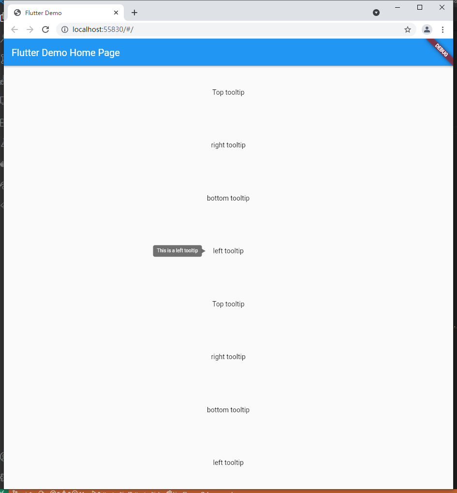
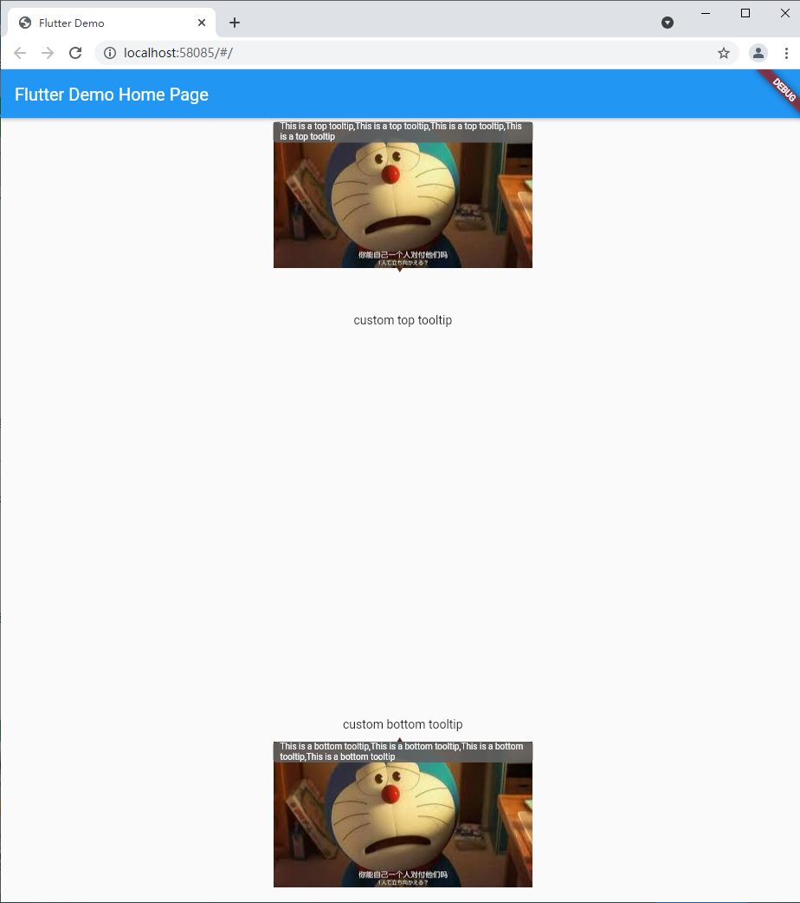

# metooltip

Reference flutter native Tooltip to implement a configurable Tooltip,
as a project to learn flutter by myself.

## Future

-   [ ] Animation Configuration

-   [ ] Optimize configuration items

## Example

-   [example1](./example/example-1/)

    

-   [example2](./example/example-2/)

    

## Getting Started

This project is a starting point for a Dart
[package](https://flutter.dev/developing-packages/),
a library module containing code that can be shared easily across
multiple Flutter or Dart projects.

For help getting started with Flutter, view our
[online documentation](https://flutter.dev/docs), which offers tutorials,
samples, guidance on mobile development, and a full API reference.
